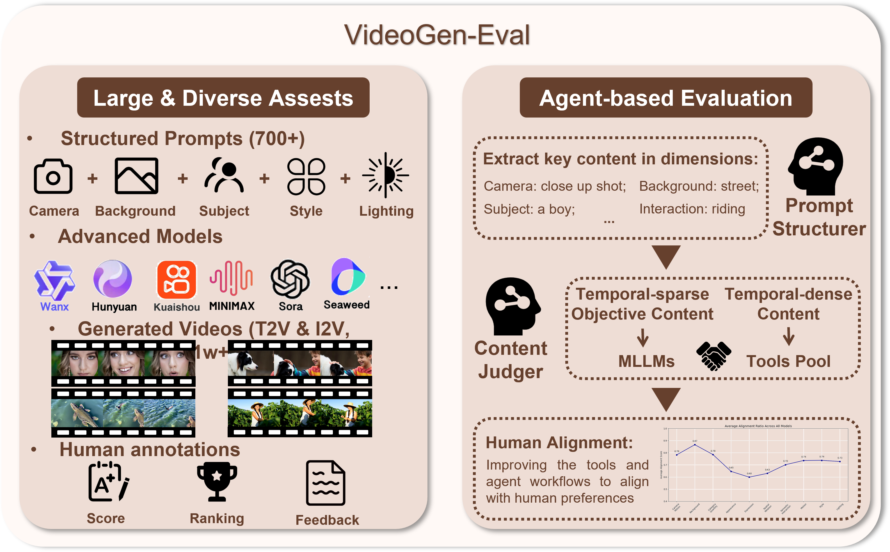

<!-- Improved compatibility of back to top link: See: https://github.com/othneildrew/Best-README-Template/pull/73 -->
<a id="readme-top"></a>

[![Contributors][contributors-shield]][contributors-url]
[![Forks][forks-shield]][forks-url]
[![Stargazers][stars-shield]][stars-url]
[![Issues][issues-shield]][issues-url]


<br />
<div align="center">
        <div style="display: flex; justify-content: center; align-items: center; gap: 10px;">
            
            
        </div>

  <h1 align="center">VideoGen-Eval: Agent-based System for Video Generation Evaluation</h1>
  
#### [<code>Project Page 🚀</code>](https://ailab-cvc.github.io/VideoGen-Eval/) | [<code>Agent Evaluation Report 📝</code>](http://arxiv.org/abs/2503.23452) | [<code>Survey Report 📝</code>](http://arxiv.org/abs/2410.05227)  | [<code>Prompt 🎬</code>](https://ailab-cvc.github.io/VideoGen-Eval/specifc_model/prompt.html)  | [<code>Video Download 🤩</code>](https://drive.google.com/drive/folders/11WxQudsVgqI-ETXQB5PQjd7dzhz41-E0?usp=sharing) | [<code>Join WeChat 💬</code>](https://github.com/AILab-CVC/VideoGen-Eval/blob/main/docs/specifc_model/wechat.md)

  <p align="center">
    <span class="author"><a href="https://yyvhang.github.io/" target="_blank">Yuhang Yang</a><sup>1</sup></span>,
      <span class="author"><a href="https://scholar.google.com/citations?user=b_5HJmQAAAAJ&hl=zh-CN" target="_blank">Ke Fan</a><sup>2</sup></span>,
      <span class="author"><a href="" target="_blank">Shangkun Sun</a><sup>3</sup></span>,
      <span class="author"><a href="https://lihxxx.github.io/" target="_blank">Hongxiang Li</a><sup>3</sup></span>,
      <span class="author"><a href="https://ailingzeng.site/" target="_blank">Ailing Zeng</a><sup>4,*</sup></span>,
      <span class="author"><a href="https://feilinh.cn/" target="_blank">Feilin Han</a><sup>5</sup></span>, <br>
      <span class="author"><a href="https://tiaotiao11-22.github.io/wzhai/" target="_blank">Wei Zhai</a><sup>1,*</sup></span>,
      <span class="author"><a href="https://scholar.google.com/citations?user=AjxoEpIAAAAJ&hl=en" target="_blank">Wei Liu</a><sup>4</sup></span>,
      <span class="author"><a href="https://scholar.google.com/citations?user=K7rTHNcAAAAJ&hl=zh-CN" target="_blank">Yang Cao</a><sup>1</sup></span>,
      <span class="author"><a href="https://scholar.google.fr/citations?user=gDnBC1gAAAAJ&hl=en" target="_blank">Zheng-Jun Zha</a><sup>1</sup></span>
    <br />
      <p><sup>1</sup>USTC, <sup>2</sup>SJTU, <sup>3</sup>PKUSZ, <sup>4</sup>Tencent, <sup>5</sup>BFA</p>
      <p><sup>*</sup>Corresponding Author</p>
  </p>
</div>


## 🔥 Project Updates
- **News**: ```2025/3/31```: We propose an agent-based video generation evaluation, which is dynamic, flexible, and evolutionary.
- **News**: ```2024/12/21```: We update results of [PramidalFlow](https://pyramid-flow.github.io/), please check our website.
- **News**: ```2024/12/10```: We update results of [Sora](https://openai.com/sora/) and the comparison results of the latest 6 Sota models.
- **News**: ```2024/12/04```: We update results of [Hunyuan](https://github.com/Tencent/HunyuanVideo), please check our website.
- **News**: ```2024/11/21```: We update results of Seaweed2.0 Pro, PixelDance2.0 Pro, Pika1.5 and Vidu1.5, please check our website.
- **News**: ```2024/11/12```: We update results of [Seaweed](https://jimeng.jianying.com/ai-tool/home) and [PixVerse-V3](https://pixverse.ai/), please check our website.
- **News**: ```2024/11/01```: We update text-to-video results of [Mochi1](https://www.genmo.ai/blog), we use `cfg=6.0`, which is the same as their website.
- **News**: ```2024/10/19```: We update 1k text-to-video results of [Meta-MovieGen](https://ai.meta.com/research/movie-gen/) (prompts are from MovieGenVideoBench); please check [here](https://ailab-cvc.github.io/VideoGen-Eval/specifc_model/MovieGen/MovieGen.html). **Plus, we make the pypi package `VGenEval` available, you can easily obtain all input prompts (text, image, video) corresponding to any ID through jsut one line of code.**
-  **News**: ```2024/10/14```: We update results of Minimax image-to-video generation, please check [here](https://ailab-cvc.github.io/VideoGen-Eval/specifc_model/minimax/minimax.html).
-  **News**: ```2024/10/08```: VideoGen-Eval-1.0 is available, please check the [Project Page](https://ailab-cvc.github.io/VideoGen-Eval/) and [Technical Report](http://arxiv.org/abs/2410.05227) for more details.

<!-- TABLE OF CONTENTS -->
<details>
  <summary>Table of Contents</summary>
  <ol>
    <li>
      <a href="#about-the-project">About The Project</a>
    </li>
    <li>
      <a href="#assets">Assets</a>
    </li>
    <li><a href="#job-list">Job List</a></li>
    <li><a href="#contributing">Contributing</a></li>
    <li><a href="#license">License</a></li>
    <li><a href="#contact">Contact</a></li>
    <li><a href="#citation">Citation</a></li>
  </ol>
</details>

## 💡 About The Project 
High-quality video generation, such as text-to-video (T2V), image-to-video (I2V), and video-to-video (V2V) generation, holds considerable significance in content creation and world simulation. Models like SORA have advanced generating videos with higher resolution, more natural motion, better vision-language alignment, and increased controllability, particularly for long video sequences. These improvements have been driven by the evolution of model architectures, shifting from UNet to more scalable and parameter-rich DiT models, along with large-scale data expansion and refined training strategies. However, despite the emergence of several DiT-based closed-source and open-source models, a comprehensive investigation into their capabilities and limitations still needs to be completed. Additionally, existing evaluation metrics often fail to align with human preferences.

This [survey report](http://arxiv.org/abs/2410.05227) studies a series of SORA-like T2V, I2V, and V2V models via to bridge the gap between academic research and industry practice and provide a more profound analysis of recent video generation advancements. This is achieved by demonstrating and comparing over 8,000 generated video cases from **ten closed-source and several open-source models** (Kling 1.0, Kling 1.5, Gen-3, Luma 1.0, Luma 1.6, Vidu, Qingying, MiniMax Hailuo, Tongyi Wanxiang, Pika1.5) via our 700 critical prompts. Seeing is believing. We encourage readers to visit our [Website](https://ailab-cvc.github.io/VideoGen-Eval/) to browse these results online. Our study systematically examines four core aspects:

Our agent-based evaluation emphasizes a **flexible, scalable, and evolving** system to keep up with the rapid development of video generation

We assign an ID to each case. The input text, the names of input images and videos correspond to the ID. The results generated by different models are named as `model_name+id.mp4`. Please refer to the [prompt](https://ailab-cvc.github.io/VideoGen-Eval/specifc_model/prompt.html). All the results are publicly accessible, and we will continuously update the results as new models are released and existing ones undergo version updates. 

## 🎞️ Assets

The inputs we introduced, including the input text, images, videos, and the generated results of all models, are available for download at [Google Drive](https://drive.google.com/drive/folders/11WxQudsVgqI-ETXQB5PQjd7dzhz41-E0?usp=sharing) and [Baidu](https://pan.baidu.com/s/16nhiiKIYn3EPRMpefEoEqw?pwd=rgha). You can also visit our [Website](https://ailab-cvc.github.io/VideoGen-Eval/) to browse these results online.

Get VideoGen-Eval prompts:
```bash
pip install VGenEval

# example
#id_list of the id e.g. [0,1,2,3]
#test_model_name of the model name e.g. 'SORA'
from VGenEval import load_prompt
results = load_prompt.get_prompts([id_list], 'test_model_name')

# result is a dict, {
#   'text prompt': [],
#   'visual prompt': [], return the url of the input image or video
#   'save name': [], We have standardized the save name
# }

# note: for the sample which takes the first-last frame for generation, visual prompt return urls of the two frames.
```

## 🦉 Job List

- [x] VideoGen-Eval-1.0 released 
- [x] Add results of multiple models.

<!-- CONTRIBUTING -->
## 💗 Contributing
Welcome all contributions! If you have a suggestion to improve this project, please fork the repo and create a pull request. You can also open an issue with the tag "enhancement."
Don't forget to give the project a star! Thanks again!

1. Fork the Project
2. Create your Feature Branch (`git checkout -b feature/AmazingFeature`)
3. Commit your Changes (`git commit -m 'Add some change'`)
4. Push to the Branch (`git push origin feature/AmazingFeature`)
5. Open a Pull Request

### 🏄 Top contributors:

<a href="https://github.com/AILab-CVC/VideoGen-Eval/graphs/contributors">
  
</a>

<!-- LICENSE -->
## ✏️ License

Distributed under the MIT License. See `LICENSE.txt` for more information.

<!-- CONTACT -->
## 📢 Contact

Ailing Zeng - [ailingzengzzz@gmail.com](mailto:ailingzengzzz@gmail.com)

Yuhang Yang - [yyuhang@mail.ustc.edu.cn](mailto:yyuhang@mail.ustc.edu.cn)

## 💌 Citation
```
@article{zeng2024dawn,
  title={The Dawn of Video Generation: Preliminary Explorations with SORA-like Models},
  author={Zeng, Ailing and Yang, Yuhang and Chen, Weidong and Liu, Wei},
  journal={arXiv preprint arXiv:2410.05227},
  year={2024}
}
```

```
@article{yang2025videogen,
  title={VideoGen-Eval: Agent-based System for Video Generation Evaluation},
  author={Yang, Yuhang and Fan, Ke and Sun, Shangkun and Li, Hongxiang and Zeng, Ailing and Han, FeiLin and Zhai, Wei and Liu, Wei and Cao, Yang and Zha, Zheng-Jun},
  journal={arXiv preprint arXiv:2503.23452},
  year={2025}
}
```

[contributors-shield]: https://img.shields.io/github/contributors/AILab-CVC/VideoGen-Eval.svg?style=for-the-badge
[contributors-url]: https://github.com/AILab-CVC/VideoGen-Eval/graphs/contributors
[forks-shield]: https://img.shields.io/github/forks/AILab-CVC/VideoGen-Eval.svg?style=for-the-badge
[forks-url]: https://github.com/othneildrew/Best-README-Template/network/members
[stars-shield]: https://img.shields.io/github/stars/AILab-CVC/VideoGen-Eval.svg?style=for-the-badge
[stars-url]: https://github.com/AILab-CVC/VideoGen-Eval/stargazers
[issues-shield]: https://img.shields.io/github/issues/AILab-CVC/VideoGen-Eval.svg?style=for-the-badge
[issues-url]: https://github.com/AILab-CVC/VideoGen-Eval/issues
[product-screenshot]: images/screenshot.png
[Next.js]: https://img.shields.io/badge/next.js-000000?style=for-the-badge&logo=nextdotjs&logoColor=white
[Next-url]: https://nextjs.org/
[React.js]: https://img.shields.io/badge/React-20232A?style=for-the-badge&logo=react&logoColor=61DAFB
[React-url]: https://reactjs.org/
[Vue.js]: https://img.shields.io/badge/Vue.js-35495E?style=for-the-badge&logo=vuedotjs&logoColor=4FC08D
[Vue-url]: https://vuejs.org/
[Angular.io]: https://img.shields.io/badge/Angular-DD0031?style=for-the-badge&logo=angular&logoColor=white
[Angular-url]: https://angular.io/
[Svelte.dev]: https://img.shields.io/badge/Svelte-4A4A55?style=for-the-badge&logo=svelte&logoColor=FF3E00
[Svelte-url]: https://svelte.dev/
[Laravel.com]: https://img.shields.io/badge/Laravel-FF2D20?style=for-the-badge&logo=laravel&logoColor=white
[Laravel-url]: https://laravel.com
[Bootstrap.com]: https://img.shields.io/badge/Bootstrap-563D7C?style=for-the-badge&logo=bootstrap&logoColor=white
[Bootstrap-url]: https://getbootstrap.com
[JQuery.com]: https://img.shields.io/badge/jQuery-0769AD?style=for-the-badge&logo=jquery&logoColor=white
[JQuery-url]: https://jquery.com 
